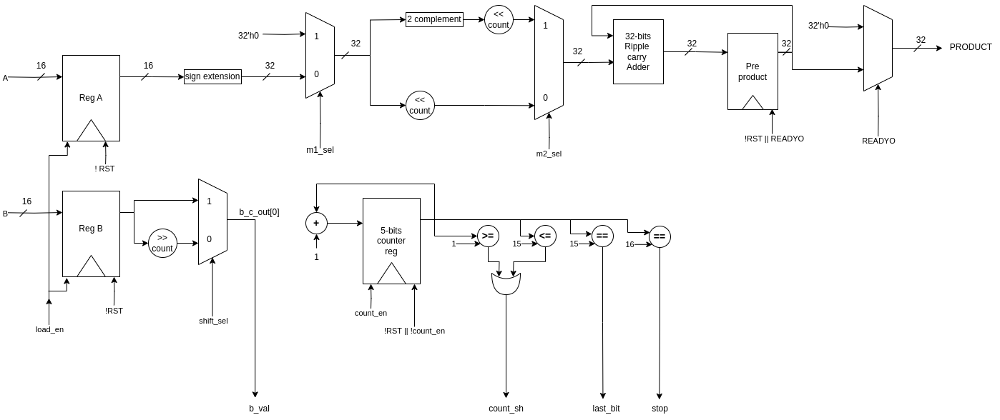

# 16x16 Sequential Signed Multiplier

## Introduction

16x16 bit sequential signed multiplier.
A and B are signed inputs of 16 bits, product is 32-bits signed output.
Finite State Machine(controller) has 1-bit register for states.
For valid output after the start signal required 16 cycles.
The testbench will randomly test for a number of inputs and also supports directed test tasks.


### Usage: Automated for Multisim

Path to code: `Moazzam/src/systemverilog/seq_multiplier`

To execute the code and view the waveform on Multisim, simply use the following command:
```
make simulator
```

To execute the code on command line, simply use the following command:
```
make run
```

Once you've completely executed the code, don't forget to clean extra files through:
```
make clean
```

## Design Details

### Top Level Diagram


### Datapath


### Controller


### Gate Count

| Module                  | Total Element | Gate Count |
| ----------------------- | -----------   | ---------- |
| 32'b Ripple Carry Adder | 1             | 160        |
| 5'b Ripple Carry Adder  | 1             | 25         |
| 32 bit 2's Compliment   | 1             | 161        |
| 32-bit 2x1 MUX          | 3             |          |
| 5'b Equal Comparator    | 4             | 29         |


Total Gate Count in Sequential Multiplier is: 376 

Total Gate Count in Combinational Multiplier is: 1413